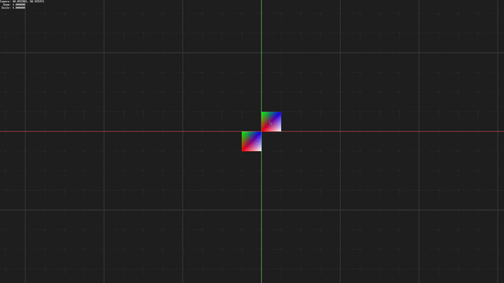

# NeoPad

A modern C17 rewrite of Pad++.

---



---

See below for:

  - [Get Started](#get-started)
  - [Usage](#usage)
  - [Developing](#developing)
    - [Directory Structure](#directory-structure)
  - 

## Get Started

Build using CMake:

```bash
cmake -B cmake-build-debug -G Ninja -DCMAKE_BUILD_TYPE=Debug
cmake --build cmake-build-debug --target neopad_demo
```

Run the demo application:

```bash
./cmake-build-debug/demo/neopad
```

## Usage

### Controls

To exit, type `:q` and press `Enter`.

- `Click + Drag` - Pan
- `Mouse Wheel` - Zoom
- `Space` - Reset View

## Developing

### Directory Structure

- `src/` - Source code
  - `internal/` - Private headers
  - `shader/` - BGFX shader files
  - `renderer/` - Renderer _feature_ implementations.
  - `renderer.c` - Core renderer implementation.
  - `neopad.c` - Doesn't serve much purpose currently.
- `test/` - Unit tests
- `demo/` - Demo application
- `include/` - Public headers
- `cmake/` - CMake modules

### Renderer Architecture

The renderer consists of a core renderer, as well as several modules
that implement _features_.

The core renderer is located in `src/renderer.c` and exposes a public header
in `include/neopad/renderer.h`. The core renderer is responsible for managing
the BGFX context, as well as the rendering pipeline. 

Renderer modules are located in `src/renderer/`, with private headers in 
`src/internal/renderer`. Modules are responsible for implementing a specific 
feature of the renderer, such as rendering text or vector graphics.

> **Note:** Modules are mainly for organization. Exposing an API for hooking 
> in custom renderer modules is currently a non-goal. The renderer is intended 
> to be a black box, with the only public API being that exposed by 
> `include/neopad/renderer.h`.

#### Render Modules

- [x] Background - background with grid and axes
- [ ] Vector - vector graphics
  - [ ] Line
  - [ ] Curve
  - [ ] Polyline
  - [ ] Polygon
  - [ ] Ellipse
  - [ ] Rectangle
- [ ] Text - text rendering